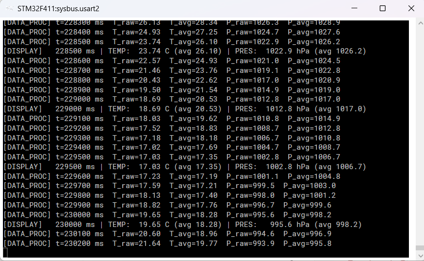

# STM32 FreeRTOS Multi-Sensor Data Logger

Real-time embedded systems project running FreeRTOS on STM32F411RE Cortex-M4.
Compiled with ARM GCC and verified running on Renode STM32 emulator.

## Live Demo
[Click here to run the GUI simulation](https://YOUR_GITHUB_USERNAME.github.io/stm32-freertos-data-logger)

## Firmware running on Renode emulator


## Architecture
| Task | Priority | Role |
|---|---|---|
| FaultMonitorTask | 4 (highest) | Semaphore-triggered fault handler |
| SensorReadTask | 3 | Simulated ADC every 100ms via vTaskDelayUntil |
| DataProcessTask | 2 | Moving average filter, mutex-protected output |
| DisplayTask | 1 (lowest) | UART formatted output every 500ms |

## FreeRTOS primitives used
- xQueueCreate / xQueueSend / xQueueReceive — sensor data pipeline
- xSemaphoreCreateBinary — fault event signalling
- xSemaphoreCreateMutex — shared data protection
- vTaskDelayUntil — precise periodic task timing
- Stack overflow detection — method 2 (fill pattern)

## Build
Compiled with STM32CubeIDE 2.1.1, ARM GCC 14.3, FreeRTOS v10.4
Target: STM32F411RETx, Cortex-M4 @ 84MHz, 128KB RAM

## Run on Renode emulator
Install Renode from https://renode.io then:
```bash
renode datalogger.resc
```

## Hardware target
NUCLEO-F411RE — flash with STM32CubeIDE using ST-Link